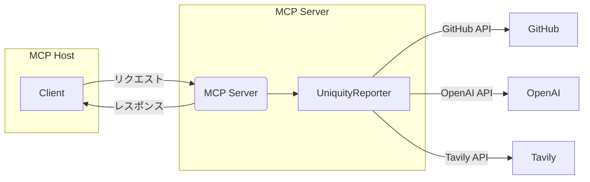

# Uniquity MCP Server

Uniquity MCP Serverは、UniquityReporterの機能をMCP（Model Context Protocol）経由で外部ツールやエージェントから利用可能にするためのラッパーサーバです。

## 目的

- UniquityReporter（本体）の分析機能をMCP Hostや各種AIエージェントから呼び出せるようにする
  https://github.com/KunihiroS/UniquityReporter
- CLI/SDK本体の責務と分離し、保守性・拡張性を高める

## 構成方針

- 本リポジトリ&#x306F;__&#x4D;CP Serverラッパーの&#x307F;__&#x3092;管理し、コアロジックは`uniquity-reporter` npmパッケージに依存します
- MCP Hostからのリクエストを受け、UniquityReporter CLI/SDKを呼び出し、結果を返却します
- 標準入出力（stdin/stdout）ベースのプロセス間通信を基本とします

## アーキテクチャ図


## 実装方針・構成

- __Node.js（TypeScript/JavaScript）で実装__
- コア分析ロジックは `uniquity-reporter` npmパッケージを利用
- MCPプロトコル対応には `@modelcontextprotocol/sdk` などの公式SDKを活用
- MCP Hostからのリクエスト（例: analyze_repository）を受け、`uniquity-reporter`のCLI/SDK APIを呼び出し、結果を標準出力で返却

### ディレクトリ構成例

```javascript
uniquity-mcp/
├── src/
│   └── index.js (または index.ts)
├── package.json
├── README.md
└── ...
```

### 依存関係

- `uniquity-reporter`（npm依存として追加）
- `@modelcontextprotocol/sdk`（MCP通信用）

```bash
pnpm add uniquity-reporter @modelcontextprotocol/sdk
```

### MCP Serverの基本実装例

```js
// src/index.js
const { Server } = require('@modelcontextprotocol/sdk');
const { analyzeProject } = require('uniquity-reporter');

const mcpServer = new Server();

mcpServer.tool('analyze_repository', async ({ repoUrl }) => {
  // 必要に応じて環境変数をセット
  // 分析実行
  const report = await analyzeProject(repoUrl, { output: 'stdout' });
  return report;
});

mcpServer.listen();
```

### 起動方法

- MCP Client からの起動
- もしくは、テスト時などは CLI からも起動

```bash
node src/index.js
```

または

```bash
npx uniquity-mcp-server
```

### 開発・テスト

- `uniquity-reporter`のバージョンアップ時は、依存を更新し動作確認を必ず実施
- CI/CDでユニットテスト・E2Eテストを自動化

### 環境変数

- MCP Host の settings.json に各種secretsおよび呼び出しコマンドを記載

## 開発ルール

- MCP ServerはNode.js（TypeScript/JavaScript）で実装
- コアロジックの改修は`uniquity-reporter`側で行い、本リポジトリではラッパー・インターフェイス層のみを管理
- バージョン管理・リリースは本体と独立して行う
- セキュリティ（APIキー等）は環境変数で管理し、コードに直接記載しない

## memo
### 2025/05/13 15:39
```
MCP Host の server呼び出し設定を整理していて気づいたことがあります
まず、下記はUniquityReporterのコマンド及び .env 仕様についての抜粋です

+++command
# Save file (--repo=on and --repofile=<output directory> are both required)
npx uniquity-reporter --repo=on --repofile=/absolute/path/to/reportdir <GitHub repository URL>
# ...Save report to the specified directory (auto-generated file name)

# Standard output only (--repo=off, --repofile is not allowed)
npx uniquity-reporter --repo=off <GitHub repository URL>
# ...Standard output (no file is generated)
+++

下記は .env のサンプルです

+++.env
# GitHub settings
# Optional (without this setting, you can analyze only public repositories)
GITHUB_TOKEN=your_github_token_here

# OpenAI settings
# role "developer" (Reasoning model recommended)
OPENAI_API_KEY=your_openai_api_key_here
OPENAI_MODEL=o3-mini

# Tavily settings
TAVILY_API_KEY=your_tavily_api_key_here

# Common settings
NODE_ENV=production
LOG_LEVEL=info
+++

上記を鑑みると MCP Host の設定は下記になると思います

+++log==off
Example: Logging Disabled
"uniquity-mcp-server": {
  "command": "npx",
  "args": [
        "-y",
        "@kunihiros/uniquity-mcp-server",
		"--repo=off",
		"--log=off"
      ],
  "env": {
	"GITHUB_TOKEN": "{apikey}",
    "OPENAI_API_KEY": "{apikey}",
	"TAVILY_API_KEY": "{apikey}",
	"OPENAI_MODEL": "{model_name}"
  }
}

+++log==on
Example: Logging Enabled (absolute log file path required)
"uniquity-mcp-server": {
  "command": "npx",
  "args": [
        "-y",
        "@kunihiros/uniquity-mcp-server",
		"--repo=off",
		"--log=on",
		"--logfile=/workspace/logs/uniquity-mcp-server.log"
      ],
  "env": {
	"GITHUB_TOKEN": "{apikey}",
    "OPENAI_API_KEY": "{apikey}",
	"TAVILY_API_KEY": "{apikey}",
	"OPENAI_MODEL": "{model_name}"
  }
}

以上を鑑みると下記の点整理が必要かと思います

1. .env 必須呼び出しキー
UniquityReporter では .env で secrets だけでなく他のキーも設定しています
現状 UniquityReporter では process.env を使って secrets を読み込んで .env からではなく MCP Host からの呼び出しに対応できるように改造しています
ただ、model も引き渡しは必要です
これも MCP Host から引き渡しを受けて設定する必要があるので UniquityReporter の修正が必要かと思います

2. ログの扱い
通常私がこれまで作ってきたMCP Serverは上記のようなログ出力を機能を提供してきました
UniquityReporterでもログが出るのですが、これは stdio で出ていると思われます (termninal で表示されるため)
MCP ServerとしてのログとUniquityReporterのログをどう整理すべきか検討が必要だと思います
その内容によっては、ログについてもUniquityReporterの改造が必要なるかと思います

まずは状況を把握してください
```