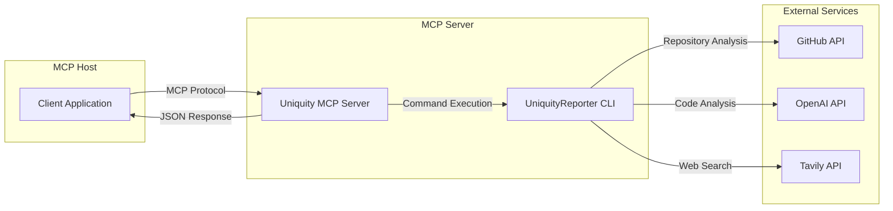

# Uniquity MCP Server

[](https://smithery.ai/server/@KunihiroS/uniquity-mcp)

## Overview

Uniquity MCP Server is a server that makes the functions of UniquityReporter available to external tools and AI agents via MCP (Model Context Protocol).

> **UniquityReporter**: [UniquityReporter](https://github.com/KunihiroS/UniquityReporter)

- Enables the analysis functions of UniquityReporter to be called from MCP Host or AI agents.
- Separates core logic and interface to improve maintainability and extensibility.
- Makes it available from various clients through a standardized protocol.

## Release Note

- 0.1.0
    - Initial version

## MCP Host Settings

### Required and Optional Environment Variables
- **Required (Must be passed from MCP Host)**
    - `GITHUB_TOKEN`: Token for GitHub API
    - `OPENAI_API_KEY`: OpenAI API key
    - `TAVILY_API_KEY`: Tavily API key
- **Optional (If not specified, the default values in config/config.js will be used)**
    - `openaiModel`: Name of the OpenAI model to use (e.g., o3-mini, gpt-4.1-nano, etc.)
    - `logEnabled`: Enable/disable log output (`on`/`off`)

### Example MCP Host Configuration

```json
{
  "uniquity-mcp": {
    "command": "npx",
    "args": [
      "-y",
      "uniquity-mcp@latest"
    ],
    "env": {
      "GITHUB_TOKEN": "{apikey}",
      "OPENAI_API_KEY": "{apikey}",
      "TAVILY_API_KEY": "{apikey}"
    }
  }
}
```
- Secrets in env settings are required.
- This MCP does not support report and log file saving.
- If file saving is required, save the standard output to a file on the Host side.

## List of Provided Tools (MCP Server)

### 1. analyze_repository
- **Description**: Generates a similarity analysis report for the specified GitHub repository. The report is always returned in Markdown format to standard output.
- **Return Value**: Report body in Markdown format (standard output)

| Argument        | Type    | Required | Description                                      |
|-----------------|---------|----------|--------------------------------------------------|
| repositoryUrl   | string  | Yes      | GitHub repository URL to analyze                 |
| openaiModel     | string  | No       | Name of the OpenAI model to use (e.g., o3-mini, gpt-4.1-nano, etc.) |
| logEnabled      | string  | No       | Enable/disable log output (`on`/`off`, default: `off`) |

### 2. list_tools
- **Description**: Returns a list of tools provided by the MCP Server and their specifications (arguments and return values).
- **Return Value**: Array of tools available in the MCP Server (including name, description, parameterSchema, returnSchema for each tool)

| Argument | Type | Required | Description |
|----------|------|----------|-------------|
| None     |      |          |             |

---

This makes it clear to MCP Hosts and clients "what tools are available" and "how to call them."

### Notes
- MCP Server supports standard output only.
- `openaiModel` and `logEnabled` can be dynamically specified as tool arguments.
- Optional values can be omitted, and if omitted, the default values of UniquityReporter will be used.

### Version Management of Dependency Package (uniquity-reporter)

- The dependency of `uniquity-reporter` in `package.json` is specified as `^1.4.4`.
  - This allows minor and patch updates to be automatically followed, but major version updates (such as 2.x) will not be automatically followed.
  - If you want to guarantee "always the latest," perform version updates and releases of the MCP Server itself, and recommend users to use `npx uniquity-mcp@latest`.

- **Note on npx Cache Behavior**
  - npx caches the retrieved packages and dependencies.
  - If you want to always use the latest version of the package and dependencies, explicitly specify `"uniquity-mcp@latest"` as in the MCP Host configuration example, and guide users to clear the cache (`npx clear-npx-cache`, etc.) for safety.

- If there are specification changes or significant updates to the dependency package, promptly version up the MCP Server and announce it in the release notes or README.

## Architecture Overview

- This repository manages only the implementation of the MCP Server and depends on the `uniquity-reporter` npm package for core logic.
- Receives requests from MCP Host, calls UniquityReporter CLI, and returns the results.
- Uses standard input/output (stdin/stdout) based inter-process communication.
- Reports are always output to standard output and are not saved to files.

## Architecture Diagram



## Technology Stack

- **Runtime**: Node.js 18+
- **Main Packages**:
  - `@modelcontextprotocol/sdk`: MCP protocol implementation
  - `uniquity-reporter`: Core analysis engine
  - `winston`: Logging
  - `dotenv`: Environment variable management
- **Development Tools**:
  - TypeScript
  - ESLint
  - Prettier
  - Jest (Testing)

### Project Structure

```
uniquity-mcp/
├── uniquity-mcp/           # Main Project
│   ├── src/
│   │   └── index.js       # Entry Point
│   └── package.json
├── .github/              # GitHub Actions Configuration
└── README.md             # This File
```

## Development Guide

### Installation

### Installing via Smithery

To install uniquity-mcp for Claude Desktop automatically via [Smithery](https://smithery.ai/server/@KunihiroS/uniquity-mcp):

```bash
npx -y @smithery/cli install @KunihiroS/uniquity-mcp --client claude
```

#### Installing Dependencies

```bash
# Install dependency packages
pnpm install

# Install including development dependencies
pnpm install --dev
```

#### Build

```bash
pnpm run build
```

#### Start in Development Mode

```bash
pnpm run dev
```

### Usage

#### Starting the MCP Server

```bash
# After building
node dist/index.js

# Or run directly
pnpm start
```

### Starting the Development Server

```bash
# Start in development mode (with hot reload)
pnpm run dev

# Build and then run
pnpm run build
pnpm start
```

## License

MIT License

## Author

[KunihiroS](https://github.com/KunihiroS)
