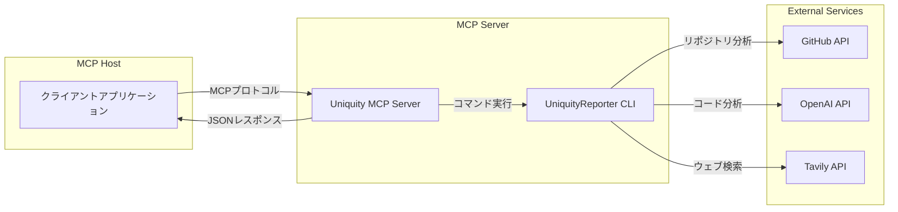

# Uniquity MCP Server

Uniquity MCP Serverは、UniquityReporterの機能をMCP（Model Context Protocol）経由で外部ツールやAIエージェントから利用可能にするためのサーバーです。

## 目的

- UniquityReporterの分析機能をMCP HostやAIエージェントから呼び出せるようにする
- コアロジックとインターフェースを分離し、保守性・拡張性を高める
- 標準化されたプロトコルで様々なクライアントから利用可能にする

> **公式リポジトリ**: [UniquityReporter](https://github.com/KunihiroS/UniquityReporter)

## アーキテクチャ概要

- 本リポジトリはMCP Serverの実装のみを管理し、コアロジックは`uniquity-reporter` npmパッケージに依存します
- MCP Hostからのリクエストを受け取り、UniquityReporter CLIを呼び出して結果を返します
- 標準入出力（stdin/stdout）ベースのプロセス間通信を使用します
- レポートは常に標準出力に出力され、ファイルには保存されません

## アーキテクチャ図



## 技術スタック

- **ランタイム**: Node.js 18+
- **主要パッケージ**:
  - `@modelcontextprotocol/sdk`: MCPプロトコル実装
  - `uniquity-reporter`: コア分析エンジン
  - `winston`: ロギング
  - `dotenv`: 環境変数管理
- **開発ツール**:
  - TypeScript
  - ESLint
  - Prettier
  - Jest (テスト)

### プロジェクト構成

```
uniquity-mcp/
├── uniquity-mcp/           # メインプロジェクト
│   ├── src/
│   │   └── index.js       # エントリーポイント
│   ├── test/              # テストコード
│   └── package.json
├── .github/              # GitHub Actions設定
└── README.md             # このファイル
```

## インストール

### 依存関係のインストール

```bash
# 依存パッケージのインストール
pnpm install

# 開発依存関係も含めてインストール
pnpm install --dev
```

### ビルド

```bash
pnpm run build
```

### 開発モードで起動

```bash
pnpm run dev
```

## 使用方法

### MCP Serverの起動

```bash
# ビルド後
node dist/index.js

# または直接実行
pnpm start
```

### 環境変数

| 変数名 | 必須 | デフォルト値 | 説明 |
|--------|------|--------------|------|
| `GITHUB_TOKEN` | はい | - | GitHub APIアクセストークン |
| `OPENAI_API_KEY` | はい | - | OpenAI APIキー |
| `TAVILY_API_KEY` | はい | - | Tavily APIキー |
| `openaiModel` | いいえ | `gpt-4.1-nano` | 使用するOpenAIモデル |
| `logEnabled` | いいえ | `off` | ログ出力の有効/無効 (`on`/`off`) |

## 開発ガイド

### 開発サーバーの起動

```bash
# 開発モードで起動（ホットリロード有効）
pnpm run dev

# ビルドしてから実行
pnpm run build
pnpm start
```

### テストの実行

```bash
# ユニットテスト
pnpm test

# カバレッジレポート付き
pnpm test:coverage
```

### コードのリンターとフォーマッター

```bash
# コードのリント
pnpm lint

# コードのフォーマット
pnpm format
```

## コントリビューション

### 開発ルール

- コードはJavaScriptで記述
- 機能追加時は必ずテストを記述する
- コミットメッセージは[Conventional Commits](https://www.conventionalcommits.org/)に従う
- プルリクエストを作成する前に`pnpm lint`と`pnpm test`を実行する

### リリース手順

1. バージョン番号を更新
2. バージョン番号を更新
3. 変更をコミット & タグを付与
4. GitHubリリースを作成

### テスト戦略

- ユニットテスト: 個々の関数・クラスのテスト
- 統合テスト: MCP Serverのエンドポイントテスト
- E2Eテスト: 実際のAPIを呼び出すテスト

## ライセンス

MIT License

## 作者

[KunihiroS](https://github.com/KunihiroS)


## MCP Host Settings

### 必須・オプション環境変数
- **必須（MCP Hostから必ず渡すこと）**
    - `GITHUB_TOKEN` : GitHub API用トークン
    - `OPENAI_API_KEY` : OpenAI APIキー
    - `TAVILY_API_KEY` : Tavily APIキー
- **オプション（未指定時はconfig/config.jsのデフォルト値が利用されます）**
    - `openaiModel` : 使用するOpenAIモデル名（例: o3-mini, gpt-4.1-nano など）
    - `logEnabled` : ログ出力の有効/無効 (`on`/`off`)

### 代表的なMCP Host設定例

MCP Serverは `repo=off` のみ対応です。

```json
{
  "uniquity-mcp-server": {
    "command": "npx",
    "args": [
      "-y",
      "@kunihiros/uniquity-mcp-server"
    ],
    "env": {
      "GITHUB_TOKEN": "{apikey}",
      "OPENAI_API_KEY": "{apikey}",
      "TAVILY_API_KEY": "{apikey}"
    }
  }
}
```

- 本MCPはレポートファイル保存はサポートしません。
- ファイル保存が必要な場合は、Host側で標準出力をファイルに保存してください。


## 提供ツール一覧（MCP Server）

### 1. analyze_repository
- **説明**: 指定したGitHubリポジトリの類似性分析レポートを生成します。レポートは常に標準出力にMarkdown形式で返されます。
- **返却値**: Markdown形式のレポート本文（標準出力）

| 引数         | 型      | 必須 | 説明                                      |
|--------------|---------|------|-------------------------------------------|
| repositoryUrl| string  | ○    | 分析対象のGitHubリポジトリURL              |
| openaiModel  | string  | ×    | 使用するOpenAIモデル名（例: o3-mini, gpt-4.1-nano など） |
| logEnabled   | string  | ×    | ログ出力の有効/無効 (`on`/`off`、デフォルト: `off`） |

### 2. list_tools
- **説明**: MCP Serverが提供するツールの一覧と仕様（引数・返却値）を返します。
- **返却値**: MCP Serverで利用可能なツールの配列（各ツールのname, description, parameterSchema, returnSchemaを含む）

| 引数 | 型 | 必須 | 説明 |
|------|----|------|------|
| なし |    |      |      |

---

これにより、MCP Hostやクライアントから「どんなツールがあるか」「どう呼び出せばいいか」が明確に分かります。

### 注意事項
- MCP Serverは標準出力のみ対応です。
- `openaiModel`と`logEnabled`はツール引数で動的に指定できます。

### 注意事項
- 必須APIキーが未設定の場合はエラーとなります。
- オプション値は省略可能です。省略時は `config/config.js` のデフォルト値が使われます。
- `.env`ファイルはローカル開発用であり、MCP Host連携時は不要です。


## 開発進捗

### 2025/5/13
- MCP Server のCLI起動確認
- MCP Host からの起動に失敗
```
MCP error -32000: Connection closed
```

### 2025/5/15
- MCP Serverの接続確認済み
- Toolの引数受付が適切になされていない
  そもそも tool 取る引数が表示されない
  コードを修正したがまだだめ
  コードの見直しが必要
- デバッグ手続き
  pnpm run build
  npx @modelcontextprotocol/inspector node /home/kunihiros/project/Uniquity-mcp/uniquity-mcp/build/index.js

### 2025/5/16
- Roo Codeからの本サーバー呼び出しを確認し、実際に動作した
- 但しいくつか課題がある
1. オプション引数の model 指定が正しく動作していない模様
gpt-4.1-nano で実行したが、動作結果は uniquity-reporter がデフォルト指定している o3-mini で実行されている模様
uniquiy-reporter 側の実装が mcp-server からの引数受取を適切に行っていない可能性が高い
2. logLevel および logFile のオプションの仕様の曖昧さ
uniquity-repoter 側でとくに logFile の書き出しがどのように処理されるのかが不明確
本mcp-serverでは repo=off がハードコーディングされており、その仕様については要求通りだが log 記録と書き出しについては要求が曖昧で実際の実装が把握できていない

上記いずれも調査対象は uniquity-reporter

### 2025/5/18
- TODO:
  - logFile 引数の削除 (書き出し先とか権限とか色々めんどくさいのでもう機能から外す)
  - npx で実行できるようにする
  - npm へ登録する