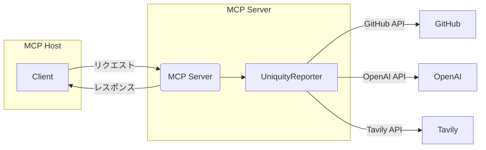

# Uniquity-mcp

Uniquity-mcpは、UniquityReporterの機能をMCP（Model Context Protocol）経由で外部ツールやエージェントから利用可能にするためのラッパーサーバです。

## 目的

- UniquityReporter（本体）の分析機能をMCP Hostや各種AIエージェントから呼び出せるようにする
  https://github.com/KunihiroS/UniquityReporter
- CLI/SDK本体の責務と分離し、保守性・拡張性を高める

## 構成方針

- 本リポジトリ&#x306F;__&#x4D;CP Serverラッパーの&#x307F;__&#x3092;管理し、コアロジックは`uniquity-reporter` npmパッケージに依存します
- MCP Hostからのリクエストを受け、UniquityReporter CLI/SDKを呼び出し、結果を返却します
- 標準入出力（stdin/stdout）ベースのプロセス間通信を基本とします

## アーキテクチャ図


## 実装方針・構成

- __Node.js（TypeScript/JavaScript）で実装__
- コア分析ロジックは `uniquity-reporter` npmパッケージを利用
- MCPプロトコル対応には `@modelcontextprotocol/sdk` などの公式SDKを活用
- MCP Hostからのリクエスト（例: analyze_repository）を受け、`uniquity-reporter`のCLI/SDK APIを呼び出し、結果を標準出力で返却

### ディレクトリ構成例

```javascript
uniquity-mcp/
├── src/
│   └── index.js (または index.ts)
├── package.json
├── README.md
└── ...
```

### 依存関係

- `uniquity-reporter`（npm依存として追加）
- `@modelcontextprotocol/sdk`（MCP通信用）

```bash
pnpm add uniquity-reporter @modelcontextprotocol/sdk
```

### MCP Serverの基本実装例

```js
// src/index.js
const { Server } = require('@modelcontextprotocol/sdk');
const { analyzeProject } = require('uniquity-reporter');

const mcpServer = new Server();

mcpServer.tool('analyze_repository', async ({ repoUrl }) => {
  // 必要に応じて環境変数をセット
  // 分析実行
  const report = await analyzeProject(repoUrl, { output: 'stdout' });
  return report;
});

mcpServer.listen();
```

### 起動方法

- MCP Client からの起動
- もしくは、テスト時などは CLI からも起動

```bash
node src/index.js
```

または

```bash
npx uniquity-mcp-server
```

### 開発・テスト

- `uniquity-reporter`のバージョンアップ時は、依存を更新し動作確認を必ず実施
- CI/CDでユニットテスト・E2Eテストを自動化

### 環境変数

- MCP Host の settings.json に各種secretsおよび呼び出しコマンドを記載

## 開発ルール

- MCP ServerはNode.js（TypeScript/JavaScript）で実装
- コアロジックの改修は`uniquity-reporter`側で行い、本リポジトリではラッパー・インターフェイス層のみを管理
- バージョン管理・リリースは本体と独立して行う
- セキュリティ（APIキー等）は環境変数で管理し、コードに直接記載しない


## MCP Host Settings

### 必須・オプション環境変数
- **必須（MCP Hostから必ず渡すこと）**
    - `GITHUB_TOKEN` : GitHub API用トークン
    - `OPENAI_API_KEY` : OpenAI APIキー
    - `TAVILY_API_KEY` : Tavily APIキー
- **オプション（未指定時はconfig/config.jsのデフォルト値が利用されます）**
    - `OPENAI_MODEL` : 使用するOpenAIモデル名（例: o3-mini, gpt-4.1-nano など）
    - `LOG_LEVEL` : ログ出力レベル（info, debug, warn, error）
    - `LOG_FILE` : ログファイルのパス

### 代表的なMCP Host設定例（repo=off固定）

MCP Serverは `repo=off` のみ対応です。

```json
{
  "uniquity-mcp-server": {
    "command": "npx",
    "args": [
      "-y",
      "@kunihiros/uniquity-mcp-server",
      "--repo=off"
    ],
    "env": {
      "GITHUB_TOKEN": "{apikey}",
      "OPENAI_API_KEY": "{apikey}",
      "TAVILY_API_KEY": "{apikey}"
    }
  }
}
```

- `repo` パラメータは必須で `off` 固定です。
- レポートファイル保存（repo=on）はサポートしません。
- ファイル保存が必要な場合は、Host側で標準出力をファイルに保存してください。
- `LOG_FILE`（ログファイル名・パス）は環境変数で指定できますが、tool引数としてもoptionalで指定可能です。

## 提供ツール一覧（MCP Server）

### 1. analyze_repository
- **説明**: 指定したGitHubリポジトリの類似性分析レポートを生成します。レポートは常に標準出力にMarkdown形式で返されます。
- **返却値**: Markdown形式のレポート本文（標準出力）

| 引数         | 型      | 必須 | 説明                                      |
|--------------|---------|------|-------------------------------------------|
| repoUrl      | string  | ○    | 分析対象のGitHubリポジトリURL              |
| openaiModel  | string  | ×    | 使用するOpenAIモデル名（例: o3-mini, gpt-4.1-nano など） |
| logLevel     | string  | ×    | ログ出力レベル（info, debug, warn, error） |
| logFile      | string  | ×    | ログファイルのパス（指定しない場合は環境変数LOG_FILE、なければデフォルト） |

### 2. list_tools
- **説明**: MCP Serverが提供するツールの一覧と仕様（引数・返却値）を返します。
- **返却値**: MCP Serverで利用可能なツールの配列（各ツールのname, description, parameterSchema, returnSchemaを含む）

| 引数 | 型 | 必須 | 説明 |
|------|----|------|------|
| なし |    |      |      |

---

これにより、MCP Hostやクライアントから「どんなツールがあるか」「どう呼び出せばいいか」が明確に分かります。

### 注意事項
- MCP Serverは標準出力（repo=off）のみ対応です。
- LOG_FILE, LOG_LEVEL, OPENAI_MODELはツール引数で動的に指定できます。

### 注意事項
- 必須APIキーが未設定の場合はエラーとなります。
- オプション値は省略可能です。省略時は `config/config.js` のデフォルト値が使われます。
- `.env`ファイルはローカル開発用であり、MCP Host連携時は不要です。
- コマンド引数（`--repo=on/off`や`--repofile`）はCLI動作制御用で、環境変数とは独立しています。

## 開発進捗

### 2025/5/13
- MCP Server のCLI起動確認
- MCP Host からの起動に失敗
```
MCP error -32000: Connection closed
```

### 2025/5/15
- MCP Serverの接続確認済み
- Toolの引数受付が適切になされていない
  そもそも tool 取る引数が表示されない
  コードを修正したがまだだめ
  コードの見直しが必要
- デバッグ手続き
  pnpm run build
  npx @modelcontextprotocol/inspector node /home/kunihiros/project/Uniquity-mcp/uniquity-mcp/build/index.js

### 2025/5/16
- Roo Codeからの本サーバー呼び出しを確認し、実際に動作した
- 但しいくつか課題がある
1. オプション引数の model 指定が正しく動作していない模様
gpt-4.1-nano で実行したが、動作結果は uniquity-reporter がデフォルト指定している o3-mini で実行されている模様
uniquiy-reporter 側の実装が mcp-server からの引数受取を適切に行っていない可能性が高い
2. logLevel および logFile のオプションの仕様の曖昧さ
uniquity-repoter 側でとくに logFile の書き出しがどのように処理されるのかが不明確
本mcp-serverでは repo=off がハードコーディングされており、その仕様については要求通りだが log 記録と書き出しについては要求が曖昧で実際の実装が把握できていない

上記いずれも調査対象は uniquity-reporter
