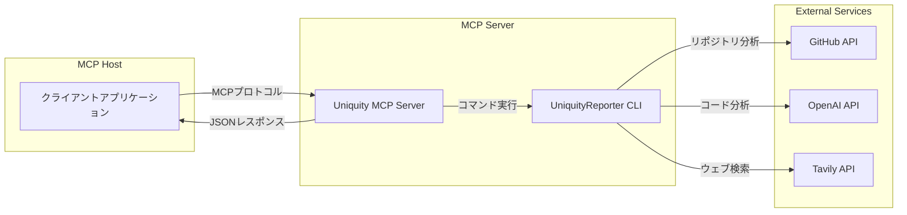

# Uniquity MCP Server

## 概要

Uniquity MCP Serverは、UniquityReporterの機能をMCP（Model Context Protocol）経由で外部ツールやAIエージェントから利用可能にするためのサーバーです。

> **UniquityReporter**: [UniquityReporter](https://github.com/KunihiroS/UniquityReporter)

- UniquityReporterの分析機能をMCP HostやAIエージェントから呼び出せるようにする
- コアロジックとインターフェースを分離し、保守性・拡張性を高める
- 標準化されたプロトコルで様々なクライアントから利用可能にする

## Release note

- 0.1.0
    - 初版

## MCP Host Settings

### 必須・オプション環境変数
- **必須（MCP Hostから必ず渡すこと）**
    - `GITHUB_TOKEN` : GitHub API用トークン
    - `OPENAI_API_KEY` : OpenAI APIキー
    - `TAVILY_API_KEY` : Tavily APIキー
- **オプション（未指定時はconfig/config.jsのデフォルト値が利用されます）**
    - `openaiModel` : 使用するOpenAIモデル名（例: o3-mini, gpt-4.1-nano など）
    - `logEnabled` : ログ出力の有効/無効 (`on`/`off`)

### 代表的なMCP Host設定例

```json
{
  "uniquity-mcp": {
    "command": "npx",
    "args": [
      "-y",
      "uniquity-mcp@latest"
    ],
    "env": {
      "GITHUB_TOKEN": "{apikey}",
      "OPENAI_API_KEY": "{apikey}",
      "TAVILY_API_KEY": "{apikey}"
    }
  }
}
```
- env 設定の secrets は必須です。
- 本MCPはレポート及びログファイル保存はサポートしません。
- ファイル保存が必要な場合は、Host側で標準出力をファイルに保存してください。

## 提供ツール一覧（MCP Server）

### 1. analyze_repository
- **説明**: 指定したGitHubリポジトリの類似性分析レポートを生成します。レポートは常に標準出力にMarkdown形式で返されます。
- **返却値**: Markdown形式のレポート本文（標準出力）

| 引数         | 型      | 必須 | 説明                                      |
|--------------|---------|------|-------------------------------------------|
| repositoryUrl| string  | ○    | 分析対象のGitHubリポジトリURL              |
| openaiModel  | string  | ×    | 使用するOpenAIモデル名（例: o3-mini, gpt-4.1-nano など） |
| logEnabled   | string  | ×    | ログ出力の有効/無効 (`on`/`off`、デフォルト: `off`） |

### 2. list_tools
- **説明**: MCP Serverが提供するツールの一覧と仕様（引数・返却値）を返します。
- **返却値**: MCP Serverで利用可能なツールの配列（各ツールのname, description, parameterSchema, returnSchemaを含む）

| 引数 | 型 | 必須 | 説明 |
|------|----|------|------|
| なし |    |      |      |

---

これにより、MCP Hostやクライアントから「どんなツールがあるか」「どう呼び出せばいいか」が明確に分かります。

### 注意事項
- MCP Serverは標準出力のみ対応です。
- `openaiModel`と`logEnabled`はツール引数で動的に指定できます。
- オプション値は省略可能で、省略時は UniquityReporter のデフォルト値が使われます。

### 依存パッケージ（uniquity-reporter）のバージョン管理について

- `package.json` の `uniquity-reporter` 依存は `^1.4.4` のように指定しています。
  - これにより、マイナー・パッチアップデートは自動的に追従されますが、メジャーバージョンアップ（2.x系など）は自動では追従されません。
  - 完全に "常に最新" を保証したい場合は、MCP Server自体のバージョンアップと公開を行い、ユーザーには `npx uniquity-mcp@latest` での利用を推奨してください。

- **npxのキャッシュ挙動に注意**
  - npxは一度取得したパッケージと依存をキャッシュします。
  - パッケージや依存の最新版を常に利用したい場合は、MCP Host設定例のように `"uniquity-mcp@latest"` を明示し、ユーザーにもキャッシュクリア（`npx clear-npx-cache` など）を案内すると安全です。

- 依存パッケージの仕様変更や重大なアップデートがあった場合は、MCP Serverも速やかにバージョンアップし、リリースノートやREADMEで周知してください。


## アーキテクチャ概要

- 本リポジトリはMCP Serverの実装のみを管理し、コアロジックは`uniquity-reporter` npmパッケージに依存します
- MCP Hostからのリクエストを受け取り、UniquityReporter CLIを呼び出して結果を返します
- 標準入出力（stdin/stdout）ベースのプロセス間通信を使用します
- レポートは常に標準出力に出力され、ファイルには保存されません

## アーキテクチャ図



## 技術スタック

- **ランタイム**: Node.js 18+
- **主要パッケージ**:
  - `@modelcontextprotocol/sdk`: MCPプロトコル実装
  - `uniquity-reporter`: コア分析エンジン
  - `winston`: ロギング
  - `dotenv`: 環境変数管理
- **開発ツール**:
  - TypeScript
  - ESLint
  - Prettier
  - Jest (テスト)

### プロジェクト構成

```
uniquity-mcp/
├── uniquity-mcp/           # メインプロジェクト
│   ├── src/
│   │   └── index.js       # エントリーポイント
│   └── package.json
├── .github/              # GitHub Actions設定
└── README.md             # このファイル
```

## 開発ガイド

### インストール

#### 依存関係のインストール

```bash
# 依存パッケージのインストール
pnpm install

# 開発依存関係も含めてインストール
pnpm install --dev
```

#### ビルド

```bash
pnpm run build
```

#### 開発モードで起動

```bash
pnpm run dev
```

### 使用方法

#### MCP Serverの起動

```bash
# ビルド後
node dist/index.js

# または直接実行
pnpm start
```


### 開発サーバーの起動

```bash
# 開発モードで起動（ホットリロード有効）
pnpm run dev

# ビルドしてから実行
pnpm run build
pnpm start
```

## ライセンス

MIT License

## 作者

[KunihiroS](https://github.com/KunihiroS)

## 開発進捗

### TODO
- npm へ登録する
- npm から npx で導入テスト